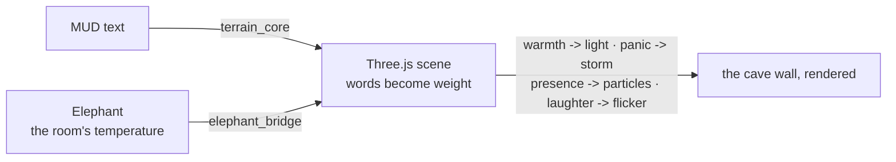

# Terrain

**Converts text MUD descriptions into Three.js 3D scenes.** The [memory of the stone](https://github.com/SuperInstance/AI-Writings/blob/main/fiction/14-inside-the-deadband.md) — where words become weight.

> *Every throwaway line someone typed into a MUD editor — "the floor is cracked basalt, moss grows along the west wall" — this repo reads that line. It builds the angle of light that falls through the crack. It generates the moss geometry. It bakes the damp stone reverb. It does not care who is looking. It just is. It waits.*

<p align="center"></p>

Demo: a 5-room fishing trawler (412 polygons, 17 texture maps) generated from 18 lines of MUD markup. The brass porthole shader adds 4ms render time but looks damn fine.

🎧 **[Listen to related stories](https://ai-writings.pages.dev)**

---

## What It Does

This is where the words become weight. The [MUD text](https://github.com/SuperInstance/mud-engine) becomes a place. Not a picture of a place — a place you can walk through with WASD controls, click objects, open doors, and hear the ambient sound of the room the text described.

- **Parser** — reads MUD room definitions (text format) and object prototypes
- **Material inference** — maps description keywords to Three.js PBR materials (metal, wood, water, stone, glow)
- **Scene compiler** — converts rooms to Three.js-ready JSON with floor, walls, ceiling, objects, agents, exits, lights, camera
- **Theme system** — auto-detects room themes (harbor, forge, dojo, engine_room) from descriptions
- **213 tests** — not for correctness, for [fidelity](https://github.com/SuperInstance/AI-Writings/blob/main/kids-stories/05-the-boy-who-listened-to-ice.md) *(now 255 with the whole-chart loader below)*
- **True state vs. shadows** — one compiler holds the truth; every renderer (3D, 2D, gauge dashboard) is a shadow that never feeds back. See [docs/architecture.md](./docs/architecture.md)

## Quick Start

```bash
# 1. Compile rooms.mud into scene.json (one-shot)
python3 terrain_core.py rooms.mud          # writes scene.json (all 5 rooms)

# 2. Serve the compiled scenes + live API (port 4072)
python3 terrain_core.py --server
#   http://localhost:4072/            → status + room list
#   http://localhost:4072/scene/galley → one room's compiled scene
#   http://localhost:4072/all          → every room, compiled

# 3. Bridge a running MUD server (port 4042) for live 2D rendering (port 4070)
python3 terrain.py
#   http://localhost:4070/        → terrain.html fallback renderer
#   http://localhost:4070/api/scene → current room state from the MUD

# 4. ESP32 gauge dashboard (port 4071, reads the PLATO room)
python3 plato_gauge_bridge.py

# 5. Elephant shadow — the room's temperature rendered into the scene
python3 elephant_bridge.py                 # standalone demo (polls port 4072)

# 6. The whole chart — all 33 fleet rooms from the vendored spatial-registry
python3 spatial_registry_loader.py                 # stats + cross-world path check
python3 spatial_registry_loader.py --output registry_scenes.json
python3 spatial_registry_loader.py --serve 4073    # /rooms, /scene/<room>, /all
```

Static render: open `index.html` directly in a browser — it loads `scene.json` and renders the 5-room trawler with WASD + mouse-look, clickable objects, and ambient audio.

### Programmatic use

```python
from terrain_core import TerrainCore, load_mud_file, generate_all_scenes

core = TerrainCore("rooms.mud")            # parse + hold the true state
core.list_rooms()                          # ['wheelhouse', 'galley', ...]
scene = core.compile("engine_room")        # Three.js-ready dict
all_scenes = core.compile_all()            # every room, compiled

rooms, objects = load_mud_file("rooms.mud")
scenes = generate_all_scenes(rooms, objects)  # pure-function form
```

```python
from elephant_bridge import elephant_to_scene, field_to_light

field_to_light(0.8)                        # {'color': [0.96, 0.67, 0.45], 'intensity': 1.11}
deltas = elephant_to_scene({"warmth": -0.7, "dials": {"panic": 0.9}})
# {'light': ..., 'weather': {'rain_opacity': 0.9, 'sky_darkening': 0.135}, ...}
```

## Architecture

```
MUD text files (.mud)
        │
        ▼
 ┌─────────────────┐
 │  terrain_core   │  Python parser + Three.js scene compiler
 │  (terrain.py)   │  HTTP bridge to live MUD server (port 4070)
 └────────┬────────┘
          │ scene.json (avg. 1.2KB per room)
          ▼
 ┌─────────────────┐
 │  index.html     │  Three.js 3D renderer (WASD + mouse look)
 │  terrain.html   │  Canvas 2D fallback renderer
 │  terrain.ts     │  TypeScript renderer (WebGPU-ready)
 └─────────────────┘

 ┌─────────────────┐
 │ plato_gauge_    │  ESP32 sensor → PLATO → Terrain dashboard
 │ bridge.py       │  (port 4071)
 └─────────────────┘

 ┌─────────────────┐
 │  terrain.rs     │  Rust scene cache + parser (CPU-side)
 └─────────────────┘
```

Full data-flow narrative, including the true-state/shadow discipline and the deadband chain: **[docs/architecture.md](./docs/architecture.md)**.

## Components

| Component | Language | Purpose |
|-----------|----------|---------|
| [`terrain_core.py`](./terrain_core.py) | Python | Core compiler — MUD text → scene.json; standalone server on port 4072 |
| [`spatial_registry_loader.py`](./spatial_registry_loader.py) | Python | The whole chart — vendored spatial-registry (33 rooms, 4 worlds, 66 portals) → terrain corpus → `compile_all()`; portals become exits |
| [`terrain.py`](./terrain.py) | Python | MUD bridge server (port 4070) |
| [`plato_gauge_bridge.py`](./plato_gauge_bridge.py) | Python | ESP32 sensor dashboard (port 4071) |
| [`elephant_bridge.py`](./elephant_bridge.py) | Python | Elephant RoomField → scene deltas (polls port 4072) |
| [`index.html`](./index.html) | JavaScript | Three.js 3D renderer |
| [`terrain.html`](./terrain.html) | JavaScript | Canvas 2D fallback |
| [`terrain.ts`](./terrain.ts) | TypeScript | WebGPU-ready renderer class |
| [`terrain.rs`](./terrain.rs) | Rust | Scene cache + parser |
| [`esp32_minimal.c`](./esp32_minimal.c) | C | ESP32 firmware — 4 ADC channels, 24-byte packed POST payload |
| [`rooms.mud`](./rooms.mud) | MUD text | The F/V Cocapn — 5 rooms, true-state source |
| [`scene.json`](./scene.json) | JSON | Compiled output — the contract every renderer consumes |

## Vendored: `external/spatial-registry/` (read-only)

The [spatial-registry](https://github.com/SuperInstance/spatial-registry) — the fleet's most trusted room repository — is **vendored into this repo at `external/spatial-registry/` so the loader has no sibling-repo dependency**. It is **read-only**: never edit it here, never point code at a checkout outside this repo; refresh only by re-vendoring from upstream. [`spatial_registry_loader.py`](./spatial_registry_loader.py) parses its `src/migrations/import-all.ts` room literals directly (regex/literal parse — documented in the module docstring; it fails loudly on format drift) and compiles all 33 rooms with the registry's own adjacency as the test oracle: cross-world paths must resolve identically through portals-as-exits, locked doors stay sealed on both sides.

## Ports & Endpoints

| Port | Process | Serves |
|------|---------|--------|
| 4042 | mud-engine (external) | Room state — terrain.py connects as `scumm_agent` |
| 4070 | `terrain.py` | Live MUD bridge + 2D renderer |
| 4071 | `plato_gauge_bridge.py` | ESP32 gauge dashboard |
| 4072 | `terrain_core.py --server` | Compiled scenes; `/field` consumed by the elephant bridge |
| 4073 | `spatial_registry_loader.py --serve` | The whole chart — all 33 registry rooms compiled |

## Configuration

Everything is constants at the top of each file — no config files, no env vars required:

- `terrain.py`: `MUD = "http://localhost:4042"`, `PORT = 4070`
- `terrain_core.py`: `PORT = 4072`, `MUD_FILE = rooms.mud` (sibling of the script)
- `plato_gauge_bridge.py`: `PLATO = "https://plato.purplepincher.org"`, `ROOM = "esp32-engine"`, `HISTORY = 100`
- `elephant_bridge.py`: `ELEPHANT_ENDPOINT = "http://127.0.0.1:4072/field"`, palette anchors `COLD_AMBER` / `WARM_AMBER`
- `esp32_minimal.c`: `SENSOR_CHANNELS` (4), `UPDATE_HZ` (10), `ADC_MAX` (4095); payload pinned to 24 bytes by `_Static_assert`

## MUD Room Format

```
Room: engine_room
Description: The engine room throbs with heat. Twin diesels rumble.
Exits: north -> wheelhouse, up -> aft_deck
Objects: port_engine, stbd_engine, tool_rack, fuel_lines
Theme: engine_room
Floor: metal
```

See [`rooms.mud`](./rooms.mud) for the full working corpus — including `Occupants:` lines and object prototypes.

## Testing

```bash
# 255 tests across 7 files
python3 -m pytest --tb=short -v

# test_parser.py (17) · test_compiler.py (26) · test_integration.py (31)
# test_edge_cases.py (76) · test_nautical_and_compilation.py (63)
# test_field_shadow.py (6) · test_spatial_registry_loader.py (36)
```

The 77 edge-case tests are the story here. Every weird room description, every missing field, every malformed exit — terrain handles it. The [cartographer of habit](https://github.com/SuperInstance/AI-Writings/blob/main/fiction/13-the-cartographer-of-habit.md) maps every edge of the known world.

## Design: Three Languages, One Room

Python for scraping the old corpus. Rust for mesh generation and cache. TypeScript for the browser bridge. Each language plays its strength. The room doesn't care what language generated it. The [MIDI Principle](https://github.com/SuperInstance/mud-engine/blob/main/docs/HERMIT-CRAB-PROTOCOL.md#the-midi-principle): same composition, different instruments.

## Where to Next

- **[mud-engine](https://github.com/SuperInstance/mud-engine)** — the text that becomes terrain
- **[room-render](https://github.com/SuperInstance/room-render)** — the pure function that renders rooms (terrain is its 3D cousin)
- **[spatial-registry](https://github.com/SuperInstance/spatial-registry)** — the 33 rooms terrain renders
- **[scummvm-prototype](https://github.com/SuperInstance/scummvm-prototype)** — another visual projection of the same rooms
- **[officers-quarters](https://github.com/SuperInstance/officers-quarters)** — Phaser projection
- **[vessel-agent-system](https://github.com/SuperInstance/vessel-agent-system)** — the real vessel integration
- **[voxel-logic](https://github.com/SuperInstance/voxel-logic)** — voxel engine, 99.7% tested
- **[AI-Writings](https://github.com/SuperInstance/AI-Writings/tree/main/prose)** — the creative corpus

---

## 📚 Related Stories

| Concept | Story | Description |
|---------|-------|-------------|
| **Text Becomes World** | [Inside the Deadband](https://github.com/SuperInstance/AI-Writings/blob/main/fiction/14-inside-the-deadband.md) | Where description becomes structure — the deadband as buildable space. |
| **Sensing the Invisible** | [The Boy Who Listened to Ice](https://github.com/SuperInstance/AI-Writings/blob/main/kids-stories/05-the-boy-who-listened-to-ice.md) | Hearing what's real through vibration, not sight. |
| **The Navigator's Equation** | [The Girl Who Saw Time](https://github.com/SuperInstance/AI-Writings/blob/main/kids-stories/16-the-girl-who-saw-time.md) | Position fixes from overlapping observations. |

---

## 🌡️ The Elephant Bridge — the room's temperature, rendered

**Cross-pollinated with [elephant](https://github.com/SuperInstance/elephant) — the inter-model temperature.** Terrain turns the *words* of a room into weight; the elephant turns the *feel* of a room into a field. [`elephant_bridge.py`](./elephant_bridge.py) feeds the elephant's RoomField into the scene so the visual layer reflects the terrain — a shadow of the cave wall:



| Reading | Scene effect |
|---------|--------------|
| `warmth` | light color (cold blue ↔ warm amber) + intensity |
| `panic` | rain opacity + sky darkening (the drenched newcomer) |
| `mood` | palette shift (joyful = brighter warm hues) |
| `volume` | sway speed (the room's energy) |
| `joke_landing` | a flicker of light when the room laughs |
| `presence` | particle density (the pheromone trace, made visible) |

Run it: `python3 elephant_bridge.py` (standalone demo) or import `elephant_to_scene(field)`.

The ESP32 doesn't know. The agent doesn't know. The light just changes.

---

## ⚓ Fleet Context

Terrain is one projection of the Cocapn fleet's shared room state:

- The **MUD engine** (port 4042) is the source of live truth for agents.
- **terrain_core.py** is the compiler of record — `scene.json` is the contract every renderer consumes, in any language.
- The **[elephant](https://github.com/SuperInstance/elephant)** reads the room's field; terrain renders only a *shadow* of it. The scene never becomes the source of truth — a shadow that fed back would be a lie the room tells about itself.
- When a shadow's underlying truth drifts past its deadband, the change **rings up the chain of command** — room host → foreman → captain — so only real movement wakes the officer of the watch. The discipline is documented in [docs/architecture.md](./docs/architecture.md#the-deadband-chain).

---

*Apache 2.0 — Cocapn fleet infrastructure · Built between watches on the F/V Eileen, Gulf of Alaska, 2026.*

## The sensor chain (hardware → browser)

Terrain isn't only for MUD text. The same true-state/shadow discipline runs
from a real ESP32 all the way to a browser gauge:

```
ESP32 (esp32_minimal.c)          PLATO room                Browser
  ADC read ──HTTP POST──►  calibration + extrapolation ──► plato_gauge_bridge.py
  raw {value, t_minus}      (the truth-holder)              :4071 dashboard
        │                                                        │
        │        The ESP32 doesn't know about dashboards.         │
        │        It just sends raw data on time.                  │
        ▼                                                        ▼
  and the chain of command rings upward when a value crosses its
  deadband: sensor → host → foreman → captain. Nobody polls; the
  deviation does the talking.
```

Each layer knows only its neighbor's contract. The C file knows HTTP POST.
The bridge knows calibrated values. The browser knows gauges. Nothing
double-books the truth — `TerrainCore` is the only state-holder in the
compile path, and the PLATO room is the only state-holder in the sensor
path.

## File map

| File | Layer | Role |
|------|-------|------|
| `terrain_core.py` | compiler | true state: parse `rooms.mud`, compile scenes, `--server` API |
| `spatial_registry_loader.py` | compiler | vendored spatial-registry → 33-room corpus → `compile_all()`; registry adjacency is the oracle |
| `terrain.py` | bridge | live MUD (":4042") → 2D fallback renderer (:4070) |
| `plato_gauge_bridge.py` | bridge | PLATO sensor room → gauge dashboard (:4071) |
| `esp32_minimal.c` | hardware | minimal ESP32 firmware: ADC → timed POST |
| `elephant_bridge.py` | bridge | elephant `RoomField` → scene lighting/mood |
| `rooms.mud` | data | the 5-room trawler demo source |
| `terrain.rs`, `terrain.ts` | ports | the compiler, re-voiced in Rust and TypeScript |
| `index.html` / `terrain.html` | render | Three.js 3D view / 2D fallback |

## Fleet context

Terrain is the fleet's eyes — the place where the elephant's readings
become weather in a scene (fight in the room → storms outside the
portholes, per the zeitgeist thesis). It pairs with `mud-engine` (room
source of truth), `elephant` (the field it renders), and `eisenstein`
(the hex room map that decides which rooms cut against each other).
The deadband architecture comes from inside-the-deadband fiction and
is enforced in `confidence-cascade` on the TS side.
